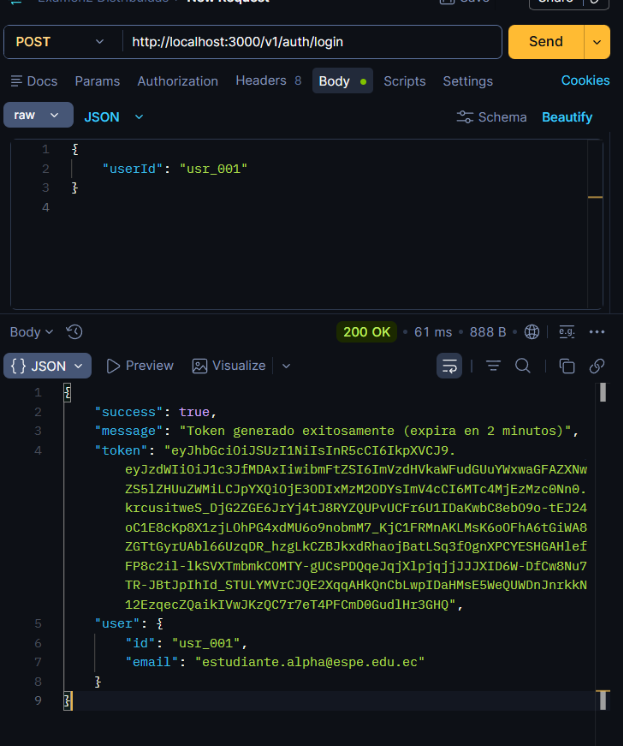
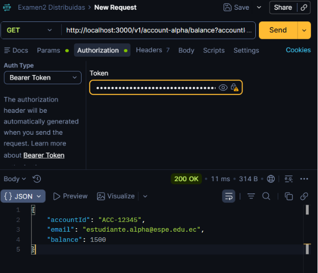
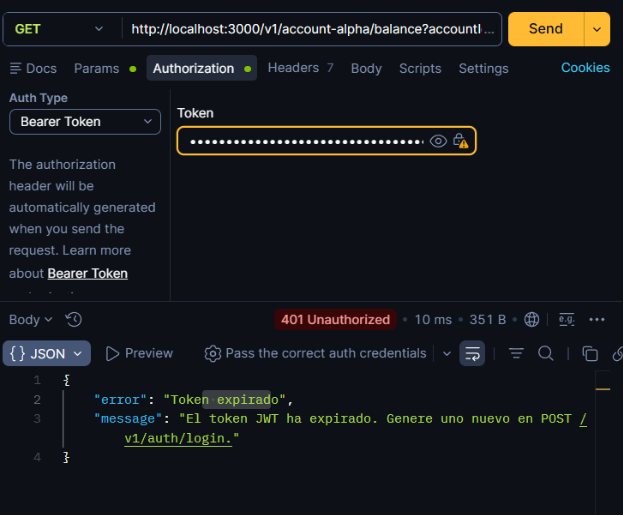
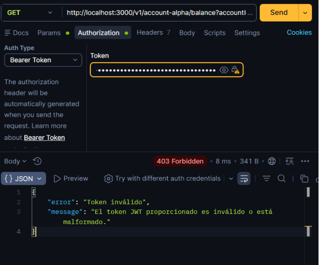
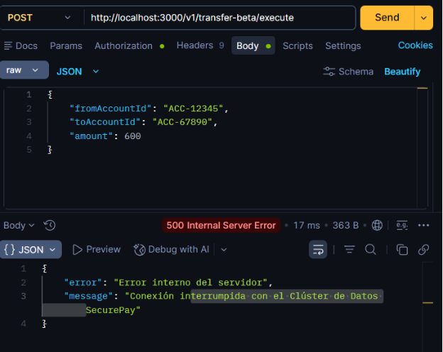
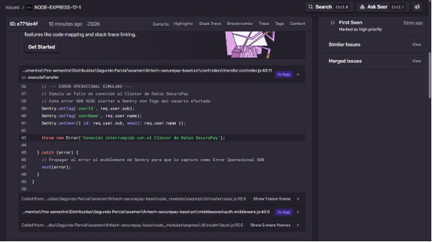

# Fintech SecurePay — Bitácora de Evaluación

**Estudiante:** Zaith Manangón  
**Materia:** Aplicaciones Distribuidas  
**Evaluación:** Segundo Parcial Práctico  

---

## Arquitectura del Proyecto

```
fintech-securepay-base/
├── index.js                           ← Entry point (Sentry init primero)
├── keypair.sh                         ← Script OpenSSL para generar llaves RSA
├── .env.example                       ← Esquema de variables de entorno
├── .gitignore                         ← node_modules/, *.pem, .env
├── src/
│   ├── instrument.js                  ← Inicialización Sentry SDK
│   ├── config/env.js                  ← Configuración de entorno
│   ├── controllers/
│   │   ├── auth.controller.js         ← Login y generación JWT
│   │   ├── account.controller.js      ← Consulta de saldo (Alpha)
│   │   └── transfer.controller.js     ← Transferencia (Beta) + Error 500
│   ├── middlewares/
│   │   └── auth.middleware.js         ← Validación Bearer Token RS256
│   ├── routes/
│   │   ├── index.js
│   │   ├── auth.routes.js
│   │   ├── account.routes.js
│   │   └── transfer.routes.js
│   └── services/
│       ├── validation.service.js      ← SRP: Validación financiera
│       ├── balance.service.js         ← SRP: Gestión de saldos
│       ├── transaction-log.service.js ← SRP: Registro de transacciones
│       ├── notification.service.js    ← SRP: Notificaciones por email
│       ├── transaction.service.js     ← DIP: Orquestador con inyección
│       ├── jwt.service.js             ← Firmado/verificación RS256
│       └── transaction.monolith.service.js ← Monolito original (referencia)
```

---

## Fase 1: Refactorización SOLID (SRP & DIP)

**Rama:** `feature/01-refactor-solid`  
**Commit:** `refactor(solid): segregar logica del monolito e inyectar dependencias por constructor`

Se descompuso el monolito `transaction.monolith.service.js` en 4 servicios independientes con responsabilidad única:

| Servicio | Responsabilidad |
|----------|----------------|
| `validation.service.js` | Búsqueda de cuentas y validación de reglas de negocio |
| `balance.service.js` | Deducción y acreditación de saldos |
| `transaction-log.service.js` | Registro de transacciones en el historial |
| `notification.service.js` | Notificaciones simuladas por correo electrónico |

Se creó `transaction.service.js` como clase orquestadora que recibe las dependencias inyectadas por constructor (DIP):

```javascript
class TransactionService {
  constructor({ validationService, balanceService, transactionLogService, notificationService }) {
    this.validationService = validationService;
    this.balanceService = balanceService;
    this.transactionLogService = transactionLogService;
    this.notificationService = notificationService;
  }
}
```

---

## Fase 2: Autenticación Stateless JWT RS256

**Rama:** `feature/02-auth-jwt`  
**Commit:** `feat(jwt): implementar firmado asimetrico rs256 y middleware de validacion autonoma public-key`

### Generación de llaves

Se ejecutó `keypair.sh` para generar el par de llaves RSA en formato PKCS#8:
- `private.pem` → Firma del JWT (solo en el servidor emisor)
- `public.pem` → Verificación del JWT (en cada microservicio de forma autónoma)

### Endpoint de Login

`POST /v1/auth/login` — Genera un JWT firmado con RS256 (expira en 2 minutos).

**Request:**
```json
{ "userId": "usr_001" }
```

### Evidencia Postman — Token Generado



### Evidencia Postman — Acceso Válido con Token



### Evidencia Postman — Token Expirado (401)



### Evidencia Postman — Token Inválido (403)



---

## Fase 3: Observabilidad & Sentry Error Tracking

**Rama:** `feature/03-observabilidad`  
**Commit:** `feat(sentry): instrumentar backend y separar manejo de excepciones logicas 401 de fallos operacionales 500`

### Regla de Observabilidad Implementada

| Tipo de Error | Código HTTP | ¿Alerta a Sentry? | Descripción |
|---------------|-------------|-------------------|-------------|
| Token expirado/malformado | 401 / 403 |  NO | Error lógico controlado |
| Conexión interrumpida con Clúster | 500 |  SÍ | Error operacional con Tags de usuario |

### Instrumentación

`src/instrument.js` se importa como **primera línea** de `index.js`, antes de Express y cualquier otra librería.

### Evidencia Sentry — Error Operacional 500



### Evidencia Sentry — Tags de Usuario Capturados



---

## Árbol de Commits Git

```
* (feature/03-observabilidad) feat(sentry): instrumentar backend y separar manejo de excepciones logicas 401 de fallos operacionales 500
* (feature/02-auth-jwt) feat(jwt): implementar firmado asimetrico rs256 y middleware de validacion autonoma public-key
* (feature/01-refactor-solid) refactor(solid): segregar logica del monolito e inyectar dependencias por constructor
* (main) chore: inicializar proyecto base fintech-securepay
```

---

## Endpoints Disponibles

| Método | Ruta | Descripción | Auth |
|--------|------|-------------|------|
| `POST` | `/v1/auth/login` | Generar JWT RS256 | No |
| `GET` | `/v1/account-alpha/balance?accountId=ACC-12345` | Consultar saldo | Sí |
| `POST` | `/v1/transfer-beta/execute` | Ejecutar transferencia | Sí |

### Usuarios de prueba

| userId | Email | Cuenta | Saldo |
|--------|-------|--------|-------|
| `usr_001` | estudiante.alpha@espe.edu.ec | ACC-12345 | $1500.00 |
| `usr_002` | docente.beta@espe.edu.ec | ACC-67890 | $350.50 |
